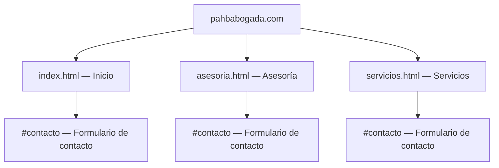

# PAHB Abogada Inmobiliaria — Documentación Completa del Sitio Web

> [!NOTE]
> Fuente: [https://pahbabogada.com/](https://pahbabogada.com/)
> Fecha de captura: 20 de mayo de 2026

---

## 1. Información General

| Campo | Valor |
|---|---|
| **Nombre** | PAHB \| Abogada Inmobiliaria |
| **Titular** | Paula Hernández Abogada |
| **Especialización** | Derecho de los Negocios \| Derecho Inmobiliario y Urbanístico |
| **Teléfono** | [310 444 2859](tel:3104442859) |
| **Email** | gerenciajuridica@paulahernandezabogada.com |
| **Instagram** | [@paulahernandezabogada](https://www.instagram.com/paulahernandezabogada/) |
| **Meta Description** | Somos un equipo jurídico experto a. Acompañamos a las empresas a tomar decisiones estratégicas y a implementarlas de manera efectiva. |
| **OG Thumbnail** | `https://sanmarianito.github.io/PAHB/img/thumbnail.png` |

---

## 2. Estructura del Sitio



### Navegación Principal
1. **Inicio** → `index.html`
2. **Asesoría** → `asesoria.html`
3. **Servicios** → `servicios.html`
4. **Contáctenos** → `#contacto` (ancla en cada página)

---

## 3. Contenido por Página

### 3.1 Página de Inicio (`index.html`)

#### Hero
- **Título principal:** Derecho de los Negocios | Derecho Inmobiliario y Urbanístico
- **Video de fondo:**
  - Desktop: `img/intro__desktop.mp4`
  - Mobile: `img/intro.mp4`
  - Poster/fallback: `img/poster.webp`
- Logo centrado: `img/PAHB_logo.svg`

#### Sección: "Un equipo jurídico experto a su disposición"
> Acompañamos integralmente a las empresas a tomar decisiones estratégicas y a implementarlas de manera efectiva en su cotidianidad y en sus proyectos.
>
> Nuestra misión es guiar la ejecución de las actividades empresariales en armonía con la normatividad vigente; gestionando de principio a fin las negociaciones con clientes, proveedores, aliados comerciales, autoridades administrativas y judiciales.

#### Sección: "Acompañamos a nuestros clientes para que hagan negocios bien hechos"
- Tenemos capacidad de respuesta oportuna, reaccionamos inmediatamente frente a cualquier evento que surja en el normal desarrollo de las actividades empresariales.
- Garantizamos absoluta confidencialidad y reserva del secreto profesional en toda la información suministrada, las comunicaciones y asesorías.
- Trabajamos con profesionalismo en todos los niveles del servicio, comunicación consistente, respeto y cercanía.
- Contamos con la administrativo y estratégico multidisciplinar; tenemos alianzas en todas las áreas del Derecho.
- Aseguramos las mejores y más eficientes prácticas jurídicas para su empresa.

---

### 3.2 Página de Asesoría (`asesoria.html`)

#### Título: "¿En qué consiste nuestra asesoría integral?"

**Servicios de asesoría:**
- Negociaciones, acompañamiento a reuniones con clientes potenciales, inversionistas, entidades financieras, fiduciarias, y cualquier otro grupo de interés.
- Formalización de acuerdos.
- Elaboración y revisión de toda clase de contratos, especialmente comerciales, civiles, fiduciarios, laborales; documentos de crédito, garantías, comunicaciones a terceros y otros documentos de carácter jurídico.
- Elaboración y asesoría en reclamaciones, requerimientos y solicitudes ante autoridades administrativas, clientes, proveedores y terceros en general.
- Elaboración de derechos de petición y acciones de tutela.
- Asistencia a audiencias de conciliación prejudicial y/o diligencias administrativas.
- Respuestas a entes de control, derechos de petición, reclamaciones, solicitudes de terceros y acciones de tutela.
- Capacitación en temas jurídicos a las áreas de la compañía que lo requieran.

#### Sección: "Modalidades de Trabajo — Nos interesan las relaciones a largo plazo"
> Garantizamos contacto permanente con la abogada titular y conectamos con otras ramas del derecho cuando sea necesario.

| Modalidad | Descripción |
|---|---|
| **Asesoría permanente** | Suma fija mensual que incluye los servicios jurídicos de acuerdo con el grado de complejidad y dedicación requeridos. |
| **Asesoría por requerimiento** | Acompañamiento en procesos puntuales que se cobran según la dificultad y el tiempo invertido. |
| **Asesoría por horas** | Tarifa de servicio por hora que se cobra mensualmente según las horas trabajadas en el mes. |
| **Litigios** | Representación en procesos a una tarifa preferencial de acuerdo con las pretensiones y la dificultad del proceso. |
| **Cobro de cartera** | Se cobrará un porcentaje sobre el valor efectivamente recaudado. |

#### Sección: "Nos mantendremos en contacto"
A través de las siguientes herramientas:
- Visitas a la compañía según requerimiento y previa coordinación de agendas.
- Envío de conceptos, contratos, acuerdos y cualquier otro documento requerido a través del correo electrónico.
- Asistencia a reuniones, audiencias de conciliación, y diligencias en general ante autoridades y/o centros de conciliación.

---

### 3.3 Página de Servicios (`servicios.html`)

#### Título: "Nuestros servicios — Nos caracteriza la atención al detalle y el rigor"

#### 1. Asuntos comerciales y societarios
- Acuerdos comerciales de colaboración empresarial.
- Contratos comerciales.
- Reclamaciones por temas relacionados con la actividad del objeto social de la compañía.
- Derecho del consumidor.
- Constitución, reformas, transformación, fusión de sociedades.
- Emisión de conceptos para Asambleas Generales o Juntas Directivas, elaboración de actas.

#### 2. Actividad inmobiliaria
- Estructuración jurídica de proyectos inmobiliarios.
- Negociaciones con propietarios de lotes, fiduciarias, entidades financieras, constructoras, proveedores y clientes.
- Contratos inmobiliarios: contratos fiduciarios, de transferencia de dominio sobre inmuebles a cualquier título, de garantía, entre otros.
- Acuerdos y Contratos para la estructuración, desarrollo, gerencia, construcción, comercialización y demás etapas de los proyectos inmobiliarios.
- Estudios de títulos, loteos, actos de transferencia y constitución de garantía sobre inmuebles o sobre derechos fiduciarios.
- Acompañamiento en trámites, diligencias y audiencias ante curadurías, oficinas de planeación y otros entes municipales.
- Asesoría en reclamaciones de incumplimiento contractual y en temas de derecho del consumidor en relación con el sector de la construcción.

#### 3. Actividad de la construcción
- Contratos de construcción de obra civil, mano de obra, suministro e instalación, de prestación de servicios para la construcción, de diseño arquitectónico y estructural.
- Acompañamiento y asesoría en negociaciones en el sector de la construcción.
- Asesoría en elaboración y participación en invitaciones privadas, ofertas, licitaciones.
- Reclamaciones por temas relacionados con la actividad constructora; pólizas, seguros y garantías.
- Derecho del consumidor en relación con el sector de la construcción.

#### 4. Asesoría a copropiedades
- Elaboración y reformas de Reglamentos de Propiedad Horizontal (Residencia, comercial o mixto).
- Cálculo de coeficientes.
- Adecuación de Reglamentos de Propiedad Horizontal a la Ley 675 de 2001.
- Asistencia a asambleas de copropietarios, como asesores de la copropiedad o en representación de los copropietarios.
- Cobro de cartera.
- Elaboración de manuales de convivencia.

#### 5. Litigio
- Servicio de representación legal para efectos judiciales o como apoderada general para temas judiciales y administrativos.
- Representación como apoderada judicial en procesos donde la empresa actúe como parte demandante o demandada.
- Interposición de recursos y agotamiento de la vía gubernativa.
- Recuperación de cartera: investigación de bienes, cobro pre-jurídico, cobro jurídico, ejecución de garantías mobiliarias.

#### 6. Reorganización empresarial
- Procesos de reorganización empresarial (Ley 1116 de 2006).
- Asesoría en procesos de liquidación empresarial judicial o voluntaria.
- Asesoría en el trámite de negociación de deudas de manera directa con entidades financieras y acreedores.
- Representación de acreedores en procesos de insolvencia, para lograr el reconocimiento de sus acreencias.

---

## 4. Formulario de Contacto (Footer — todas las páginas)

El footer incluye un formulario con los siguientes campos:
- **Nombre Completo** (input text, required)
- **Email** (input email, required)
- **Teléfono** (input tel, required)
- **Mensaje** (textarea, autoexpandible)
- **Botón:** "Enviar"

Efecto de labels flotantes animados (float-label pattern).

---

## 5. Identidad Visual y Diseño

### 5.1 Paleta de Colores (CSS Custom Properties)

| Variable | Hex | Uso |
|---|---|---|
| `--amarillo` | `#ffc300` | Acento principal, botones, bordes laterales, bullets, highlights |
| `--amarillo-oscuro` | `#c79900` | Hover/estados activos |
| `--negro` | `#000000` | Fondos oscuros, headers de sección, tipografía fuerte |
| `--gris` | `#e6e6e6` | Fondos de sección, header backgrounds |
| `--blanco` | `#ffffff` | Texto sobre fondos oscuros, fondos claros |

### 5.2 Tipografía

| Propiedad | Valor |
|---|---|
| **Font Family** | `"Open Sans", sans-serif` |
| **Import** | `@import url("https://fonts.googleapis.com/css2?family=Open+Sans:ital,wght@0,300..800;1,300..800&display=swap")` |
| **Peso títulos** | `800` (extra bold) |
| **Peso párrafos** | `100-300` (light) |
| **Peso navegación** | `100` (thin) |

### 5.3 Motivos de Diseño

1. **Video dinámico en Hero** — Siluetas de profesionales en tono ámbar/cálido
2. **Barra lateral vertical izquierda (desktop)** — Franja amarilla (`55px`) que transiciona a negra
3. **Acentos diagonales** — `clip-path: polygon()` para bordes diagonales en header y footer
4. **Animaciones scroll-driven** — `animation-timeline: view()` con fade-in desde abajo
5. **Glassmorphism en menú móvil** — `backdrop-filter: blur(11.5px)` con fondo translúcido
6. **Hamburger animado** — Líneas que rotan a "X" con transiciones CSS
7. **Nav auto-hide** — Se oculta al hacer scroll down, reaparece al hacer scroll up
8. **Float labels** — Inputs con labels que se elevan al enfocar/validar

---

## 6. Assets del Sitio

### 6.1 Imágenes y Media

| Asset | Ruta |
|---|---|
| Favicon | `img/favicon.png` |
| Logo principal (light) | `img/PAHB_logo.svg` |
| Logo principal (dark) | `img/PAHB_logo_dark.svg` |
| Logo firma (light) | `img/PaulAbog_logo.svg` |
| Logo firma (dark) | `img/PaulAbog_logo-dark.svg` |
| Video hero desktop | `img/intro__desktop.mp4` |
| Video hero mobile | `img/intro.mp4` |
| Poster/fallback | `img/poster.webp` |
| OG Thumbnail | `https://sanmarianito.github.io/PAHB/img/thumbnail.png` |

### 6.2 Iconos SVG

| Icono | Ruta |
|---|---|
| Teléfono | `img/tel_icon.svg` |
| Email | `img/mail_icon.svg` |
| LinkedIn | `img/in_icon.svg` |
| WhatsApp (flotante) | `img/icon_ws.svg` |

### 6.3 Archivos Técnicos

| Archivo | Ruta |
|---|---|
| CSS principal | `css/main.css` |
| CSS source map | `css/main.css.map` |
| JavaScript | `java.js` |

---

## 7. Comportamiento Responsive

| Breakpoint | Valor |
|---|---|
| **Desktop** | `min-width: 971px` |
| **Mobile** | `< 971px` (default) |

### Desktop (`≥ 971px`)
- Navegación horizontal fija con fondo semitransparente negro (`rgba(0,0,0,0.6)`)
- Barra lateral izquierda amarilla/negra (`55px`)
- Grids de 2 columnas para contenido y footer
- Footer en grid: `"logo formulario" / "contacto formulario" / "logoAbg formulario"`
- Video hero con `height: 600px`
- WhatsApp widget: `right: 32px`

### Mobile (`< 971px`)
- Menú hamburguesa con panel deslizante glassmorphism
- Layout de 1 columna lineal
- Video hero con `height: 300px`
- Sin barra lateral izquierda
- Footer apilado verticalmente

---

## 8. JavaScript (`java.js`)

### Funcionalidades:
1. **Textarea auto-expandible** — Calcula `scrollHeight` para ajustar dinámicamente el número de filas del textarea del formulario de contacto.
2. **Menú auto-hide en scroll** — Agrega/remueve clase `.nav--hidden` al navbar según dirección del scroll (down = ocultar, up = mostrar).

```javascript
// Textarea auto-expand
document.addEventListener('input', onExpandableTextareaInput)

// Nav hide on scroll
const nav = document.querySelector(".menu");
let lastScrollY = window.scrollY;
window.addEventListener("scroll", () => {
  if (lastScrollY < window.scrollY) {
    nav.classList.add("nav--hidden");
  } else {
    nav.classList.remove("nav--hidden");
  }
  lastScrollY = window.scrollY;
});
```

---

## 9. Animaciones CSS

| Animación | Keyframes | Trigger |
|---|---|---|
| `reveal` | `opacity: 0 → 1`, `translateY(100px → 0)` | Scroll-driven (`animation-timeline: view()`) |
| `lineRg` | `scaleX(0% → 100%)` | Scroll-driven — entrada de títulos h2/h3 |
| `txtop` | `translateY(50px → 0)`, `opacity: 0 → 1` | Scroll-driven — texto dentro de títulos |
| Burger menu | `rotate(45deg)`, `scaleX(0)`, `rotate(-45deg)` | Checkbox toggle |
| Nav slide | `translateY(-70px)` | Scroll direction detection via JS |
| Float labels | `top: 0 → -28px`, color change | Input `:focus` / `:valid` states |

---

## 10. SEO y Meta Tags

| Meta | Contenido |
|---|---|
| `<title>` | PAHB \| Abogada Inmobiliaria |
| `og:description` | Somos un equipo jurídico experto a. Acompañamos a las empresas a tomar decisiones estratégicas y a implementarlas de manera efectiva. |
| `og:image` | `https://sanmarianito.github.io/PAHB/img/thumbnail.png` |
| Favicon | `img/favicon.png` |

> [!WARNING]
> La meta description parece tener un error gramatical: "equipo jurídico experto **a**" — probablemente debería decir "experto **a su disposición**" o similar.
